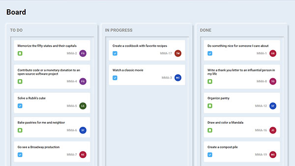

# ToDo Board (PERN App)



It includes the following:

- Backend API with Express & PostgreSQL
- JWT authentication
- Protected routes and endpoints
- Custom middleware to check JSON web token and store in cookie
- Custom error middleware
- React frontend to register, login, logout, view profile, update profile, add/edit tasks, D&D
- React Material UI library

## Usage

- Create a PostgreSQL database and setup your `PostgreSQL config params`

### Env Variables

Rename the `.env.example` file to `.env` and add the following

```
NODE_ENV = development
PORT = 5000
DB_NAME=todos
DB_USER=postgres
DB_PASSWORD=admin
DB_HOST=localhost
DB_PORT=5432
JWT_SECRET = 'abc123'
```

Change the JWT_SECRET to what you want

### Install Dependencies (frontend & backend)

```
npm install
cd frontend
npm install
```

### Run

```

# Run frontend (:3000) & backend (:5000)
npm run dev

```

## Build & Deploy

```
# Create frontend prod build
cd frontend
npm run build
```
